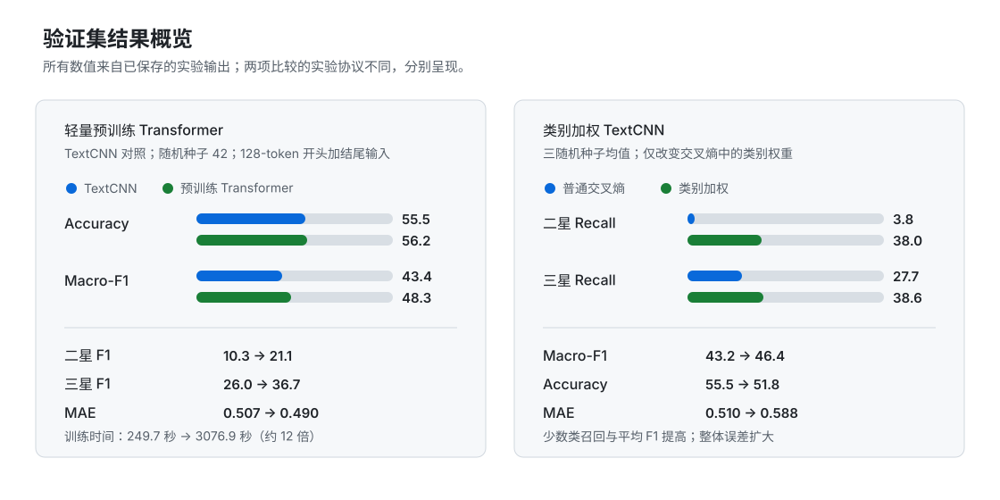

# 中文餐饮评论星级分类实验

使用美团 ASAP 中文餐饮评论，依据评论正文预测 1—5 星评分。项目关注二星、三星等中间评分的识别，并比较类别加权和预训练模型带来的取舍。

## 实验设置

- 数据划分：训练 / 验证 / 测试集分别为 36,850 / 4,940 / 4,940 条；
- 输入与标签：评论正文 `review` → 星级 `star`；
- 指标：Accuracy、Macro-F1、MAE，以及二星、三星的逐类指标；
- 模型：TF-IDF + 逻辑回归、TextCNN、轻量预训练 Transformer。

## 核心结果

基础模型在配置确定后进行一次测试集评价：

| 模型 | Accuracy | Macro-F1 | MAE |
| --- | ---: | ---: | ---: |
| TF-IDF + 逻辑回归 | 0.5605 | **0.4577** | 0.5004 |
| TextCNN | **0.5634** | 0.4354 | **0.4988** |

- 类别加权 TextCNN：在三个随机种子下，验证集 Macro-F1 从 0.4318 提高到 0.4642；二星 Recall 从 0.0382 提高到 0.3795。Accuracy 从 0.5545 降到 0.5175，MAE 从 0.5101 升到 0.5876。
- 预训练 Transformer：在验证集上，Macro-F1 从 TextCNN 的 0.4344 提高到 0.4832；二星、三星 F1 分别从 0.1026、0.2602 提高到 0.2110、0.3671。训练时间约为 TextCNN 的 12 倍。

## 结论与局限

- 类别加权让模型更愿意预测少数星级，提高了召回率和 Macro-F1，同时带来整体 Accuracy、MAE 的代价；
- 预训练模型在当前验证集上改善了中间评分表现；
- 预训练实验只运行一个随机种子，且约 99.8% 的评论因 128-token 输入上限而被截断；
- 类别加权只比较一种权重公式与三个随机种子，结果仍需更多实验检验。

## 详细材料

- [实验报告](report/experiment_report.md)
- [错误分析](results/error_analysis.md)
- [结果与配置](results/)
- [代码](src/)

环境配置、参考代码和调试环节使用了 coding agent。
